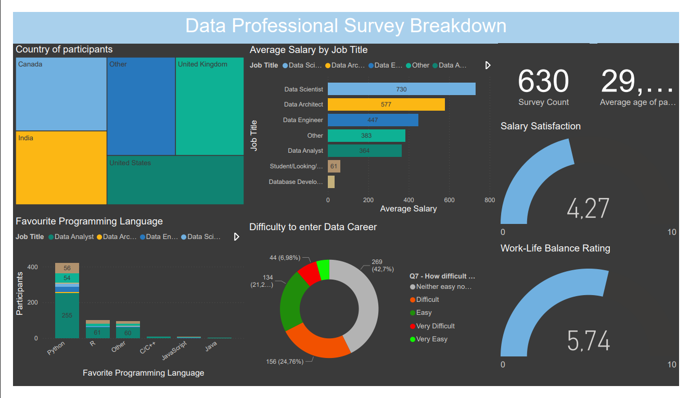

# Data Careers Power BI Dashboard

An interactive business intelligence project analysing salary, job satisfaction, work-life balance, and role trends across data careers.

## Project Focus

The dashboard turns raw survey-style data into a clean Power BI reporting experience for people evaluating careers in analytics, data science, engineering, and business intelligence.

It answers practical questions such as:

- Which data roles report the strongest salary outcomes?
- How does satisfaction vary across job titles and regions?
- Which skills and career paths appear most attractive for entry-level analysts?
- Where are the trade-offs between compensation, work-life balance, and career growth?

## Tools Used

- Power BI
- Microsoft Excel
- Data cleaning and transformation
- Exploratory data analysis
- Dashboard design

## Files

- `Main project.pbix` - Power BI dashboard file
- `Power BI - Final Project.xlsx` - source workbook
- `image.png` - dashboard preview

## What This Demonstrates

- Cleaning and shaping data for BI reporting
- Building stakeholder-friendly visuals
- Turning analysis into business questions
- Presenting insights clearly for non-technical users

## Portfolio Note

This project is positioned as a business intelligence case study. It complements the machine learning projects in this portfolio by showing the ability to move from raw data to a finished reporting product.
